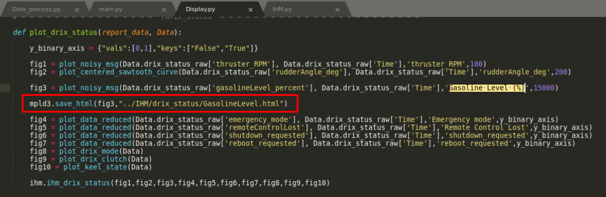
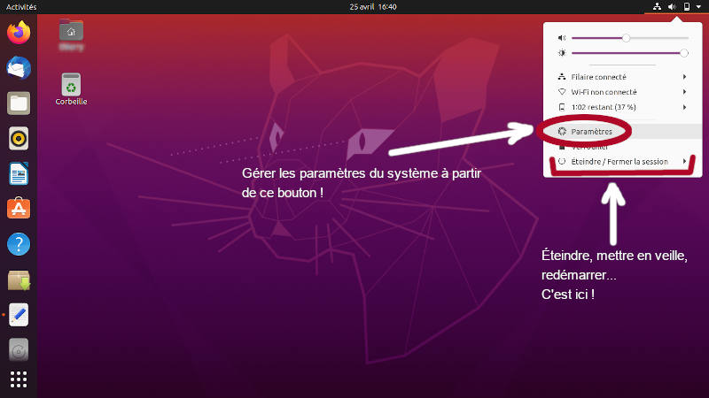

# Report creation

Code permettant de générer une version bêta du rapport de mission


## Pour lancer le code
Une fois que la machine virtuelle est lancée, ouvrir l'emplacement du code (le dossier src),  
Puis clique droit > Open in Terminal.  
Une fois le terminal ouvert, lancer le code `main.py`.
```
python3 main.py
```
*(Soit en recopiant à la main, soit en copiant collant avec Ctrl+Maj V ou avec le clic molette)*  
Le code va ensuite générer le rapport de mission dans le dossier IHM.  


## Pour changer les paramètres du code
Ouvrir le script **main.py** et changer les variables **path**, **data_d**, **date_f** qui se situent en fin de code.


### Paramétrage ++
Actuellement, le rapport de mission regroupe les graphiques par topic.  
Cependant, si vous souhaitez extraire une figure en particulier, voici la procédure:

Exemple pour extraire le graphique représentant l'évolution du niveau d'essence:  
Ouvrir le script **Display.py**.  
**Ctrl + F** + titre du graph ici "Gasoline Level (%)"  
Puis identifier la variable qui stoque la figure, ici fig3. Et ajouter 
```
mpld3.save_html(variable,"directory/nom.html")
Pour notre exemple : mpld3.save_html(fig3,"../IHM/drix_status/GasolineLevel.html")
```
*(Penser à respecter les indentations)*
 
 

## Aide pour la machine virtuelle
Pour connecter une clef USB à la machine virtuelle :  
https://www.pcastuces.com/pratique/astuces/4829.htm


Pour éteindre la machine virtuelle : 
 


